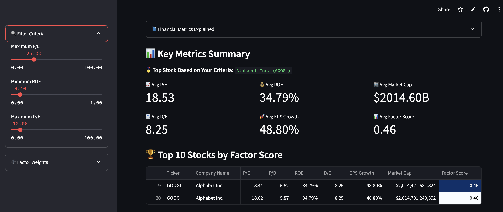

# 📈 Stocks Screener

A dynamic, interactive web app to screen and rank S&P 500 stocks based on key financial factors like valuation, profitability, growth, and risk. Built with Python and Streamlit, this app empowers users to explore investment opportunities using real data and custom logic

---

## 🚀 Live Demo
👉 [Try the app](https://moh1tt-stocks.streamlit.app/)

---

## 🧠 Why This Project?

In modern investing, **factor-based strategies** are used by quant funds, asset managers, and financial analysts to construct smarter portfolios. This project brings those principles to life — interactively.

Built to:
- Explore **value, growth, and quality** stocks with real metrics
- Visualize relationships between financial features (ROE, EPS, P/E, etc.)
- Simulate portfolio allocation based on user savings
- Serve as an educational tool for finance + data science learners

---

## 💼 Use Cases

- 📊 **Retail investors** seeking data-driven stock ideas
- 🎓 **Data science students** learning financial analysis
- 📈 **Quant-curious developers** exploring screening models
- 🧮 **Portfolio builders** simulating real-world allocations

---

## ⚙️ Features

- 🔍 Filter stocks by P/E, ROE, EPS Growth, D/E and more
- ⚖️ Assign custom weights to financial factors
- 📊 View ranked stocks with factor scoring
- 📈 Visualize results with charts (scatter, bar, pie)
- 💸 Simulate savings-based investment plans
- 📥 Export results as CSV
- 📚 Learn the meaning behind each financial metric

---

## 📌 Screenshots

> 
> *Example: Factor Score Ranking & Visual Insights*

---

## 📁 Tech Stack

| Tool | Purpose |
|------|---------|
| `Python` | Core logic and data processing |
| `Streamlit` | Web UI and interactivity |
| `Pandas` | Data wrangling |
| `Matplotlib / Seaborn` | Visualization |
| `yfinance` | Financial data |
| `Git + Streamlit Cloud` | Versioning + deployment |

---

## 📦 Installation

```bash
git clone https://github.com/moh1tt/factor-based-stock-screener.git
cd factor-based-stock-screener
pip install -r requirements.txt
streamlit run app.py
